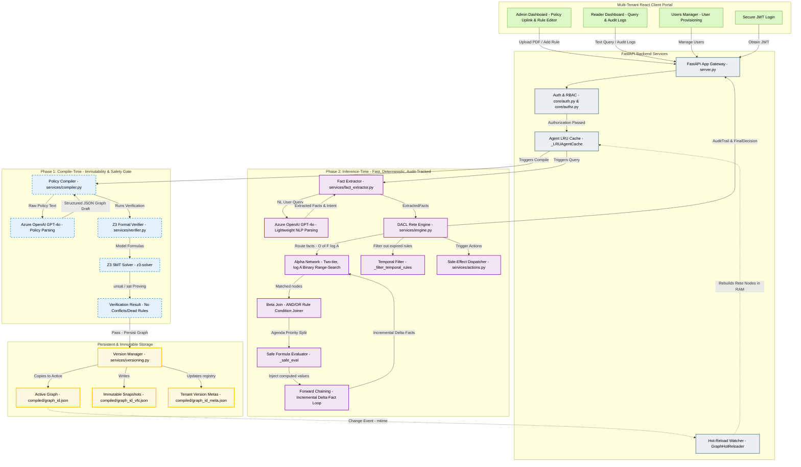

# Architecture & Algorithmic Blueprint: DACL Agent

Deterministic Autonomous Contract Language (DACL) is an enterprise-grade framework designed to combine the **cognitive flexibility of Large Language Models (LLMs)** with the **absolute correctness, security, speed, and auditability of formal rules engines**. 

DACL solves the problem of "AI hallucinations" in critical business systems (such as insurance underwriting, freight pricing, and compliance checking) by splitting the decision lifecycle into a **two-phase hybrid architecture**:
1. **Compile-Time Phase (LLM once + Z3 SMT Formal Proofs)**: Translate natural language business policy documents into a structured, validated, and mathematically consistent rule graph stored on disk.
2. **Inference-Time Phase (LLM lightweight fact-extraction + pure Rete Execution)**: Route real-time user inputs through a lightning-fast, zero-LLM deterministic Rete rule network with full audit trails.

---

## 1. Project Architecture Diagram

The diagram below maps the multi-tenant frontend, FastAPI server gateway, security layers, and the compile vs. inference service flows.



---

## 2. End-to-End Service Flow

The interaction between backend services during both stages of the rule lifecycle operates as follows:

### A. Compile-Time Flow (Policy Onboarding)
1. **Uplink**: An administrator uploads a natural-language contract or policy document (PDF/TXT) via the React Admin Portal, targeting the `/api/upload` endpoint in `server.py`.
2. **Parsing**: The uploaded document passes to `services/extractor.py` to extract raw text (capping clean strings at $100,\!000$ characters).
3. **Compilation**: `services/compiler.py` transmits the text to Azure OpenAI (`GPT-4o`) with a highly structured system prompt. GPT-4o analyzes the rules, translates them into Python-evaluable formulas, assigns mathematical priorities, and generates a structured JSON graph adhering to the `DACLGraph` Pydantic schema.
4. **Formal Verification Gate**: The freshly constructed graph is routed to `services/verifier.py` (supported by the Z3 SMT solver). It validates the policy rules mathematically, seeking logical loops, unsatisfiable conditions, and overlapping rules with identical priority bounds. If `strict_verify` is enabled and any errors are discovered, the compilation fails, blocking deployment.
5. **Immutable Versioning**: If verification passes, `services/versioning.py` captures the graph, increments the version counter, saves the historical source text, and writes an immutable snapshot (`compiled/graph_id_vN.json`) alongside updating the active file pointer (`compiled/graph_id.json`).
6. **Zero-Downtime Hot Reload**: The background daemon `GraphHotReloader` detects the filesystem modified timestamp (`mtime`) on `compiled/graph_id.json`. It loads the new rules and immediately swaps the in-memory Rete network in the active agent cache without requiring a server reboot.

### B. Inference-Time Flow (Rule Execution)
1. **Query Entry**: A user or an external automated service fires a natural-language query (e.g., *"How much is it to ship a 0.8 kg package over 450 km with a fuel index of 4.2?"*) to `/api/query` in `server.py`.
2. **Synonym Matching & Fact Extraction**: `services/agent.py` scans the rule conditions and actions of the compiled graph to collect the exact list of required facts. It triggers `services/fact_extractor.py` (making a lightweight, low-latency LLM call) to extract these exact variables from the user's unstructured request, translating colloquial terms to matching system keys (e.g., *"tobacco"* to `smoker`, *"body mass index"* to `bmi`).
3. **Fact Normalization**: The extracted dictionary is flattened by `_flatten_facts` in `services/engine.py`, converting nested dictionaries (e.g., `{"order": {"amount": 100}}`) into standardized dot-notation variables (`"order.amount": 100`) for seamless formula processing.
4. **Rete Alpha Activation**: The active `DACLReteEngine` triggers its pre-compiled `AlphaNetwork`. Rather than conducting an $O(N \times C)$ linear traversal across all conditions in all rules, it uses a two-tier index:
   - **Tier 1 (Field Hash Index)**: Direct $O(1)$ mapping to locate active rules using the extracted facts.
   - **Tier 2 (Binary Search Range Index)**: Numerical boundary evaluations ($>, \ge, <, \le$) are sorted and computed using $O(\log A)$ binary partitioning (`bisect`).
5. **Beta Joint Resolution**: Matched alpha nodes are evaluated according to their boolean operators (`AND` or `OR`) in the beta phase to assert rule triggers.
6. **Temporal Scope Check**: Active rules are cross-referenced with `_filter_temporal_rules` to assert whether the request timestamp sits within a rule's `temporal_from` and `temporal_to` ISO-8601 windows.
7. **Forward Chaining Loop**: Matches are grouped into an agenda sorted by priority. The highest-priority rule fires first, feeding its action formula into the `_safe_eval` sandbox (which executes mathematical formulas safely without exposed built-in structures). The output value is injected back into the active fact space, triggering **incremental alpha evaluations** for down-chain dependencies until a mathematical fixpoint is achieved.
8. **Durable Actions**: Side effects mapped to successful rule conditions (e.g., updating database tables or notifying operators) are handled by the idempotent dispatcher in `services/actions.py`.
9. **Auditable Response**: A detailed `DACLResponse` is compiled and returned, packing a transparent `AuditTrail` representing evaluated rules, matched bounds, variables, forward-chain depth, and structural results.

---

## 3. Core Algorithms & Mathematical Intuition

### A. Formal Static Verification (The Z3 SMT Solver)
To guarantee system correctness, `services/verifier.py` uses the **Z3 Satisfiability Modulo Theories (SMT)** solver. Z3 represents variables as infinite real numbers and solves system constraints to check for logical inconsistencies before the rules are run.

```
                  ┌──────────────────────────────┐
                  │    Compiled DACLRule Graph   │
                  └──────────────┬───────────────┘
                                 │
                   [ Translate Conditions to Z3 ]
                                 │
                                 ▼
                  ┌──────────────────────────────┐
                  │  Z3 Real Variable Assertions │
                  └──────────────┬───────────────┘
                                 │
        ┌────────────────────────┼────────────────────────┐
        ▼                        ▼                        ▼
┌───────────────┐        ┌───────────────┐        ┌───────────────┐
│ Unsatisfiable │        │   Priority    │        │  Subsumption  │
│  Check (Dead) │        │  Conflict (≈) │        │  Check (High) │
│               │        │               │        │  always masks │
│ Solver.add(C) │        │Solver.add(    │        │   Rule Low)   │
│               │        │  C_A ∧ C_B    │        │               │
│  Is it UNSAT? │        │  ∧ P_A == P_B │        │Solver.add(    │
│               │        │)              │        │  C_Low ∧ ¬C_H │
│               │        │               │        │)              │
│               │        │  Is it SAT?   │        │  Is it UNSAT? │
└───────────────┘        └───────────────┘        └───────────────┘
```

#### 1. Unsatisfiable Rules Check (Dead Rules)
A rule is "dead" if its conditions form a mathematical contradiction, making it impossible to fire on any input.

*   **Mathematical Intuition**: Let a rule $R$ possess a set of constraints $\mathcal{C} = \{C_1, C_2, \dots, C_n\}$. Z3 asserts:
    $$\exists X \in \mathbb{R}^d \text{ s.t. } \bigwedge_{i=1}^n C_i(X) = \text{True}$$
    If Z3 returns `unsat` (unsatisfiable), no such input $X$ exists, proving the rule is dead.

*   **Example**:
    $$C_1: \text{weight} > 1.0 \quad \land \quad C_2: \text{weight} < 0.5$$
    Z3 translates this to:
    $$\text{Solver.add}(w > 1.0, w < 0.5) \implies \text{unsat} \implies \text{\textbf{Error: Dead Rule}}$$

#### 2. Priority Conflict Check
If two rules have overlapping condition spaces and identical priorities, the engine's execution order becomes non-deterministic.

*   **Mathematical Intuition**: Let rule $R_A$ have constraints $\mathcal{C}_A$ and rule $R_B$ have constraints $\mathcal{C}_B$. If their priorities are equal ($\text{Priority}_A = \text{Priority}_B$), Z3 checks:
    $$\exists X \in \mathbb{R}^d \text{ s.t. } \left( \bigwedge C_A(X) \right) \land \left( \bigwedge C_B(X) \right) = \text{True}$$
    If Z3 returns `sat` (satisfiable), the rules overlap, creating a non-deterministic execution hazard.

*   **Example**:
    $$\text{Rule A (Priority 100)}: \text{distance} > 300 \quad \text{Rule B (Priority 100)}: \text{weight} > 0.5 \land \text{distance} > 200$$
    These rules overlap when $\text{distance} = 400$ and $\text{weight} = 0.8$.
    $$\text{Solver.add}(d > 300, w > 0.5, d > 200) \implies \text{sat} \implies \text{\textbf{Error: Priority Conflict}}$$

#### 3. Rule Subsumption Check (Masked Rules)
A lower-priority rule is subsumed (masked) if a higher-priority rule always covers its entire condition space, preventing the lower-priority rule from ever firing.

*   **Mathematical Intuition**: Let $R_{high}$ be a rule with higher priority covering space $\mathcal{S}_{high}$, and $R_{low}$ be a lower priority rule covering space $\mathcal{S}_{low}$. 
    Subsumption occurs when $\mathcal{S}_{low} \subseteq \mathcal{S}_{high}$. This is mathematically equivalent to proving that the logical implication $R_{low} \implies R_{high}$ is a tautology:
    $$\forall X \in \mathbb{R}^d, \quad \mathcal{C}_{low}(X) \implies \mathcal{C}_{high}(X)$$
    To prove this, Z3 attempts to satisfy the negation:
    $$\mathcal{C}_{low}(X) \land \neg \mathcal{C}_{high}(X)$$
    If this negation is `unsat`, it mathematically proves that $\mathcal{C}_{low}$ can never be true while $\mathcal{C}_{high}$ is false, confirming that $R_{low}$ is fully subsumed and dead.

*   **Example**:
    $$\text{Rule High (Priority 200)}: \text{distance} > 300$$
    $$\text{Rule Low (Priority 100)}: \text{distance} > 500 \land \text{weight} > 1.0$$
    Negation set in Z3:
    $$\text{Solver.add}( (d > 500 \land w > 1.0) \land \neg(d > 300) )$$
    $$\text{Since } d > 500 \implies d > 300 \text{, } \neg(d > 300) \text{ contradicts } d > 500 \text{, yielding \textbf{unsat}}.$$
    Hence, Rule Low is completely subsumed by Rule High, generating a compilation warning.

---

### B. High-Performance Rete Discrimination
The core optimization of the `DACLReteEngine` is its **Alpha Discrimination Network**. The engine indexes conditions to skip irrelevant evaluations entirely.

```
                        [ Extracted Facts Input ]
                                    │
                                    ▼
                      ┌───────────────────────────┐
                      │    Tier 1 Hash Lookup     │  <-- O(1) Isolates active fields
                      └─────────────┬─────────────┘
                                    │
                                    ▼
                      ┌───────────────────────────┐
                      │ Tier 2 Sorted Array Index │
                      └─────────────┬─────────────┘
                                    │
                         [ Binary Search: bisect ]
                                    │
          ┌───────────────────┬─────┴─────────────┬───────────────────┐
          ▼                   ▼                   ▼                   ▼
      Op: ">"             Op: ">="            Op: "<"             Op: "<="
   threshold < val     threshold ≤ val     threshold > val     threshold ≥ val
      Nodes:              Nodes:              Nodes:              Nodes:
  [:bisect_left]      [:bisect_right]     [bisect_right:]     [bisect_left:]
    pass True           pass True           pass True           pass True
```

#### 1. Two-Tier Indexing Strategy
*   **Tier 1: Field Hash Indexing**: Conditions are grouped by their subject variable. If the incoming facts do not contain `distance`, all distance-related conditions are skipped in $O(1)$ time.
*   **Tier 2: Sorted Numeric Threshold Array**: Range conditions ($>, \ge, <, \le$) for a given field are kept in sorted threshold arrays. Evaluating these conditions uses binary search instead of checking them one by one.

#### 2. Binary Range Partitioning via Bisect
For any given field and operator, the threshold boundaries are sorted in ascending order:
$$T = [t_1, t_2, \dots, t_n] \quad \text{where } t_1 \le t_2 \le \dots \le t_n$$
When an input fact value $v$ arrives, the engine performs a single binary search to find the insert index $s$:
$$s = \text{bisect}(T, v)$$
This single search determines the boolean truth value of all $n$ conditions simultaneously:

| Operator | Evaluated Condition | Passing Nodes | Mathematical Range |
| :---: | :--- | :--- | :--- |
| **`>`** | $v > \text{threshold}$ | `nodes[:bisect_left]` | threshold values $< v$ |
| **`>=`** | $v \ge \text{threshold}$ | `nodes[:bisect_right]` | threshold values $\le v$ |
| **`<`** | $v < \text{threshold}$ | `nodes[bisect_right:]` | threshold values $> v$ |
| **`<=`** | $v \le \text{threshold}$ | `nodes[bisect_left:]` | threshold values $\ge v$ |

*   **Complexity Reduction**: For $100,\!000$ active rules with average $3$ conditions per rule ($300,\!000$ conditions total):
    *   **Naive Linear Scan**: $O(N \times C) \approx 300,\!000$ checks.
    *   **DACL Rete Search**: $O(F \times \log A) \approx \mathbf{50}$ checks (a **$6,\!000\times$ acceleration**).

---

### C. Incremental Forward Chaining (Fixpoint Induction)
When a rule matches, its action formula evaluates and inserts its output back into the working memory. This new value can trigger other rules down the line.

```
                          ┌───────────────────────┐
                          │    Extracted Facts    │
                          └───────────┬───────────┘
                                      │
                                      ▼
                      ┌───────────────────────────────┐
                      │    Full Alpha Activation      │  <-- Iteration 0
                      └───────────────┬───────────────┘
                                      │
                                      ▼
                      ┌───────────────────────────────┐
      ┌──────────────>│   Priority Agenda Resolution  │  <-- Picks highest matching rule
      │               └───────────────┬───────────────┘
      │                               │
      │                               ▼
      │                       [ Evaluate Rule ]
      │                               │
      │                   [ Generate Output Value ]
      │                               │
      │                               ▼
      │               ┌───────────────────────────────┐
      │               │    Write to Working Memory    │
      │               └───────────────┬───────────────┘
      │                               │
      │                    [ Extracted Delta Facts ]
      │                               │
      │                               ▼
      │               ┌───────────────────────────────┐
      │               │  Incremental Alpha Activation │  <-- Only processes new variable
      │               └───────────────┬───────────────┘
      │                               │
      ├───────────────────────────────┘
      │
[ Fixpoint Met / Loop Exhausted ]
      │
      ▼
┌───────────────────────────┐
│     Produce AuditTrail    │
└───────────────────────────┘
```

*   **Mathematical Model**: Let $\mathbf{W}_k$ represent the working facts at step $k$, initialized by the user's input:
    $$\mathbf{W}_0 = \mathbf{F}_{\text{initial}}$$
    Let $\mathcal{R}_{\text{active}}(\mathbf{W}_k)$ be the set of rules triggered by the current facts. The engine selects the highest-priority rule $R_* \in \mathcal{R}_{\text{active}}(\mathbf{W}_k)$ and fires its action formula:
    $$v_{\text{new}} = \text{eval}(R_*.\text{formula}, \mathbf{W}_k)$$
    The working facts are updated with this new value, creating the next state $\mathbf{W}_{k+1}$:
    $$\mathbf{W}_{k+1} = \mathbf{W}_k \cup \{ R_*.\text{output\_field}: v_{\text{new}} \}$$
    The change between steps is the **delta fact**:
    $$\Delta_k = \{ R_*.\text{output\_field}: v_{\text{new}} \}$$
    To maintain high performance, the engine runs the new delta $\Delta_k$ through the Rete network instead of re-evaluating the entire working memory $\mathbf{W}_{k+1}$:
    $$\text{AlphaResults}_{k+1} = \text{AlphaNetwork.activate}(\Delta_k, \text{existing}=\text{AlphaResults}_k)$$
    This loop continues until it reaches a **fixpoint** where no new facts are generated, or it hits the maximum allowed chain depth (default: $20$):
    $$\mathbf{W}_{k+1} = \mathbf{W}_k \implies \text{Fixpoint Met}$$

---

## 4. Concrete Algorithmic Execution Walkthrough

Let's walk through an execution using the built-in **Freight Pricing Policy**:

### 1. Compiled Rule Graph
```json
{
  "graph_id": "freight_policy_graph",
  "domain": "freight_pricing",
  "default_action": {
    "output_field": "tier",
    "formula": "'C'"
  },
  "rules": [
    {
      "rule_id": "rule_1",
      "priority": 220,
      "condition_logic": "AND",
      "conditions": [
        {"field": "weight", "operator": ">", "value": 1.0},
        {"field": "distance", "operator": ">", "value": 500.0}
      ],
      "action": {
        "output_field": "tier",
        "formula": "'A'"
      }
    },
    {
      "rule_id": "rule_2",
      "priority": 210,
      "condition_logic": "AND",
      "conditions": [
        {"field": "weight", "operator": ">", "value": 0.5},
        {"field": "distance", "operator": ">", "value": 300.0}
      ],
      "action": {
        "output_field": "tier",
        "formula": "'B'"
      }
    },
    {
      "rule_id": "rule_3_premium",
      "priority": 200,
      "condition_logic": "AND",
      "conditions": [
        {"field": "tier", "operator": "==", "value": "A"}
      ],
      "action": {
        "output_field": "base_rate",
        "formula": "5.50 + (fuel_index - 4.00) * 0.30"
      }
    },
    {
      "rule_id": "rule_4_standard",
      "priority": 190,
      "condition_logic": "AND",
      "conditions": [
        {"field": "tier", "operator": "==", "value": "B"}
      ],
      "action": {
        "output_field": "base_rate",
        "formula": "4.10 + (fuel_index - 4.10) * 0.22"
      }
    },
    {
      "rule_id": "rule_5_calc",
      "priority": 180,
      "condition_logic": "AND",
      "conditions": [
        {"field": "base_rate", "operator": ">", "value": 0.0}
      ],
      "action": {
        "output_field": "final_amount",
        "formula": "base_rate * distance * weight"
      }
    }
  ]
}
```

### 2. Input Scenario
*   **User Query**: *"I have a package weighing 1.2 kg. I need to ship it 600 km. The current fuel index is 4.5. Give me the final price."*
*   **Step 1: Fact Extraction** (`fact_extractor.py`):
    *   `weight` $\rightarrow 1.2$
    *   `distance` $\rightarrow 600.0$
    *   `fuel_index` $\rightarrow 4.5$

### 3. Step-by-Step Forward Chaining Loop

#### Iteration 0: Initial Fact Setup
*   **Working Memory $\mathbf{W}_0$**:
    $$\{\text{weight}: 1.2, \, \text{distance}: 600.0, \, \text{fuel\_index}: 4.5\}$$
*   **Alpha Activation**:
    *   `weight` array `[0.5, 1.0]`. Fact value $1.2 > 1.0 \implies \text{Conditions (weight > 0.5) and (weight > 1.0) pass}$.
    *   `distance` array `[300.0, 500.0]`. Fact value $600.0 > 500.0 \implies \text{Conditions (distance > 300) and (distance > 500) pass}$.
*   **Beta Join Results**:
    *   `rule_1` conditions (`weight > 1.0` AND `distance > 500.0`): **Passes**.
    *   `rule_2` conditions (`weight > 0.5` AND `distance > 300.0`): **Passes**.
    *   `rule_3_premium` conditions (`tier == "A"`): **Fails** (no `tier` variable exists in memory yet).
*   **Agenda Resolution**: `rule_1` (priority 220) is chosen over `rule_2` (priority 210).
*   **Fire**: `rule_1` sets `tier` to `"A"`.
*   **Delta $\Delta_0$**: `{"tier": "A"}` is added to working memory.

#### Iteration 1: Tier Determined
*   **Working Memory $\mathbf{W}_1$**:
    $$\{\text{weight}: 1.2, \, \text{distance}: 600.0, \, \text{fuel\_index}: 4.5, \, \mathbf{tier: "A"}\}$$
*   **Incremental Alpha Activation**: Only evaluate the new delta `tier = "A"`.
*   **Beta Join Results**:
    *   `rule_3_premium` conditions (`tier == "A"`): **Passes**.
    *   `rule_4_standard` conditions (`tier == "B"`): **Fails**.
*   **Agenda Resolution**: `rule_3_premium` (priority 200) fires.
*   **Formula Evaluation**:
    $$\text{base\_rate} = 5.50 + (\text{fuel\_index} - 4.00) * 0.30$$
    $$\text{base\_rate} = 5.50 + (4.5 - 4.00) * 0.30 = 5.50 + 0.15 = \mathbf{5.65}$$
*   **Delta $\Delta_1$**: `{"base_rate": 5.65}` is added to working memory.

#### Iteration 2: Base Rate Determined
*   **Working Memory $\mathbf{W}_2$**:
    $$\{\text{weight}: 1.2, \, \text{distance}: 600.0, \, \text{fuel\_index}: 4.5, \, \text{tier}: "A", \, \mathbf{base\_rate: 5.65}\}$$
*   **Incremental Alpha Activation**: Only evaluate the new delta `base_rate = 5.65`.
*   **Beta Join Results**:
    *   `rule_5_calc` conditions (`base_rate > 0.0`): **Passes**.
*   **Agenda Resolution**: `rule_5_calc` (priority 180) fires.
*   **Formula Evaluation**:
    $$\text{final\_amount} = \text{base\_rate} * \text{distance} * \text{weight}$$
    $$\text{final\_amount} = 5.65 * 600.0 * 1.2 = \mathbf{4068.0}$$
*   **Delta $\Delta_2$**: `{"final_amount": 4068.0}` is added to working memory.

#### Iteration 3: Final Price Determined
*   **Working Memory $\mathbf{W}_3$**:
    $$\{\text{weight}: 1.2, \, \text{distance}: 600.0, \, \text{fuel\_index}: 4.5, \, \text{tier}: "A", \, \text{base\_rate}: 5.65, \, \mathbf{final\_amount: 4068.0}\}$$
*   **Incremental Alpha Activation**: No new rules match the delta.
*   **Fixpoint Achieved**: The engine exits the execution loop and builds the final audit trail response.

---

## 5. Audit Trail & Deterministic Output

The final execution output returned to the React portal contains the completed audit trail showing exactly which rules matched and why:

```json
{
  "success": true,
  "answer": "Forward chain executed [rule_1 → rule_3_premium → rule_5_calc]: final_amount = 4068.0, base_rate = 5.65, tier = 'A'",
  "output": {
    "tier": "A",
    "base_rate": 5.65,
    "final_amount": 4068.0
  },
  "audit": {
    "query": "I have a package weighing 1.2 kg. I need to ship it 600 km. The current fuel index is 4.5. Give me the final price.",
    "intent": "calculate freight shipping price and tier",
    "extracted_facts": {
      "weight": 1.2,
      "distance": 600.0,
      "fuel_index": 4.5
    },
    "execution_strategy": "rete",
    "rules_evaluated": [
      {
        "rule_id": "rule_1",
        "matched": true,
        "conditions_evaluated": [
          {"field": "weight", "operator": ">", "expected_value": 1.0, "fact_value": 1.2, "passed": true},
          {"field": "distance", "operator": ">", "expected_value": 500.0, "fact_value": 600.0, "passed": true}
        ],
        "action_applied": "'A'",
        "output_value": "A"
      },
      {
        "rule_id": "rule_3_premium",
        "matched": true,
        "conditions_evaluated": [
          {"field": "tier", "operator": "==", "expected_value": "A", "fact_value": "A", "passed": true}
        ],
        "action_applied": "5.50 + (fuel_index - 4.00) * 0.30",
        "output_value": 5.65
      },
      {
        "rule_id": "rule_5_calc",
        "matched": true,
        "conditions_evaluated": [
          {"field": "base_rate", "operator": ">", "expected_value": 0.0, "fact_value": 5.65, "passed": true}
        ],
        "action_applied": "base_rate * distance * weight",
        "output_value": 4068.0
      }
    ],
    "winning_rule_id": "rule_1",
    "final_output": {
      "tier": "A",
      "base_rate": 5.65,
      "final_amount": 4068.0
    },
    "audit_clause": "Section 3.1 - Premium Freight Schedule",
    "engine_version": "v1.0.0",
    "timestamp": "2026-06-01T21:22:20Z",
    "chained_rules": ["rule_1", "rule_3_premium", "rule_5_calc"],
    "chain_depth": 2
  }
}
```
