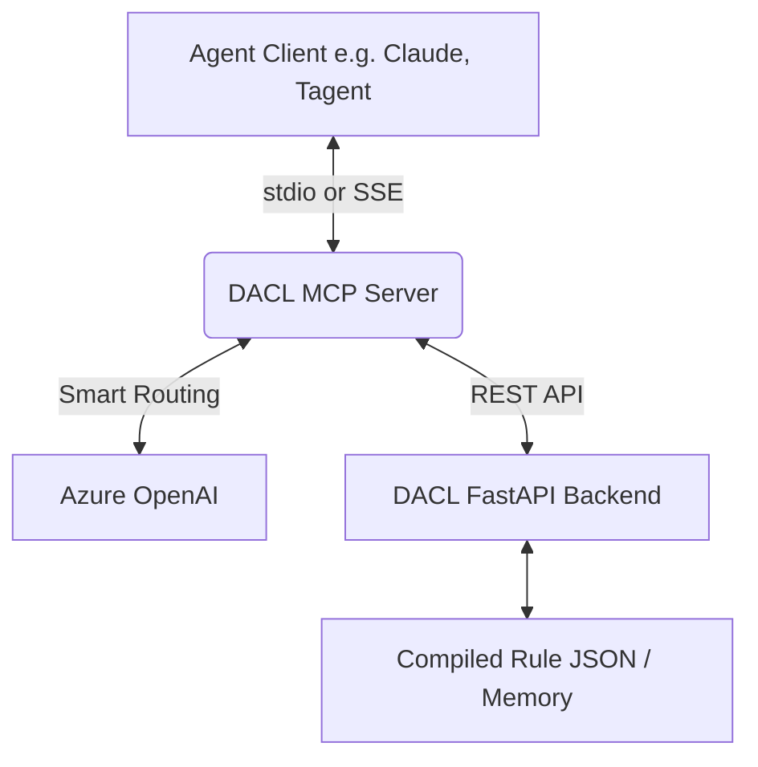

# DACL Model Context Protocol (MCP) Server

## Overview

The DACL (Deterministic AI Contract Logic) MCP Server is a bridge that connects Agentic workflows (like Claude, Tagent, HR Agents, or Jira Agents) to the DACL deterministic rule engine. It provides standardized tools, resources, and prompts over the Model Context Protocol, allowing any LLM-based agent to validate scenarios, enforce enterprise policies, and ensure mathematical and logical correctness without halluncination.

This server allows AI agents to:
- Dynamically discover available business policies.
- Understand the schema and variables required for any policy.
- Validate plain-text scenarios or raw documents (PDFs, Excel) against deterministic rules.
- Draft new policies or explain specific decisions.

## Quick Start (< 5 minutes to first success)

1. Ensure your DACL FastAPI backend and MCP server are running (Docker Compose runs the MCP server via SSE on port `8080`).
2. Point your external AI workflow (LangGraph, CrewAI, Custom Agent) to the SSE endpoint at `http://localhost:8080/sse`.

### Python Workflow Example (LangChain / Native MCP)

```python
from mcp import ClientSession
from mcp.client.sse import sse_client
import asyncio

async def run_deterministic_check():
    # Connect to the actively running DACL MCP Server
    async with sse_client("http://localhost:8080/sse") as transport:
        async with ClientSession(transport) as session:
            await session.initialize()
            
            # Use the DACL engine to validate a scenario
            result = await session.call_tool(
                "validate_scenario",
                arguments={
                    "query": "I have a 1.2kg package going 600km.",
                    "domain": "auto"
                }
            )
            print(result)

if __name__ == "__main__":
    asyncio.run(run_deterministic_check())
```

### Node.js / TypeScript Workflow Example

```typescript
import { Client } from "@modelcontextprotocol/sdk/client/index.js";
import { SSEClientTransport } from "@modelcontextprotocol/sdk/client/sse.js";

async function connectToDacl() {
  const transport = new SSEClientTransport(new URL("http://localhost:8080/sse"));
  const client = new Client(
    { name: "hr-workflow-agent", version: "1.0.0" },
    { capabilities: { tools: {} } }
  );

  await client.connect(transport);
  
  // Call the deterministic validation tool
  const result = await client.callTool({
    name: "validate_scenario",
    arguments: { query: "User has 3 years tenure, requesting 5 days leave." }
  });
  
  console.log(result);
}

connectToDacl();
```

## Configuration

The server can be configured using environment variables (often loaded from a `.env` file):

| Environment Variable | Default | Description |
|----------------------|---------|-------------|
| `DACL_BASE_URL` | `http://localhost:8000/api/v1/workflow` | URL to the DACL backend API. |
| `DACL_API_KEY` | `your_generated_api_key` | API Key for authenticating with the DACL backend. |
| `DACL_MCP_TRANSPORT` | `stdio` | Transport mode. Use `sse` for HTTP-based Server-Sent Events, or `stdio` for standard input/output. |
| `DACL_MCP_HOST` | `127.0.0.1` | Host for SSE transport mode. |
| `DACL_MCP_PORT` | `8080` | Port for SSE transport mode. |
| `AZURE_OPENAI_API_KEY` | (Required for Smart Routing) | Your Azure OpenAI API key used for the "auto" smart intent routing. |
| `AZURE_OPENAI_ENDPOINT`| (Required for Smart Routing) | Your Azure OpenAI endpoint. |
| `AZURE_OPENAI_DEPLOYMENT`| `gpt-4o` | The deployment name for the Azure OpenAI model. |
| `AZURE_OPENAI_API_VERSION`| `2024-12-01-preview` | The Azure OpenAI API version. |

## Available Capabilities

### 🛠 Tools

Agents can invoke these tools to interact with the DACL engine:

1. **`list_available_policies`**
   - **Description:** Returns a list of all active business policy domains (e.g., `freight_policy_graph`).
   - **Usage:** Call this first to know which domains exist before validating.

2. **`validate_scenario` (Alias: `validate_business_rule`)**
   - **Description:** Validates a natural language scenario description against deterministic business rules.
   - **Parameters:**
     - `input` / `query` (str): The natural language description.
     - `domain` (str, default: `"auto"`): The specific policy graph to check. If set to `"auto"`, the server uses an LLM-based smart router to automatically determine the correct policy domain based on the scenario.

3. **`validate_document_file`**
   - **Description:** Validates a raw file (PDF, TXT, Excel) accessible on the local filesystem against a policy.
   - **Parameters:** `file_path` (absolute path), `domain` (str).

4. **`validate_document_base64`**
   - **Description:** Validates a document sent as a base64 string. Perfect for agents running in environments without shared file systems.
   - **Parameters:** `base64_content`, `filename`, `domain`.

### 📄 Resources

Read-only data exposed to the agent:

1. **`dacl://policies/{graph_id}/schema`**
   - **Description:** Returns the JSON Schema of the variables required for a specific policy graph.
   - **Usage:** Agents can read this to understand exactly what facts need to be extracted from a user to run a complete evaluation.

### 📝 Prompts

Pre-configured prompt templates:

1. **`explain-policy-decision`**
   - **Description:** Generates an explanation of a policy decision given a winning rule ID, an audit clause, and the input facts.
2. **`draft-dacl-rules`**
   - **Description:** Guides an agent on how to translate a natural language business policy document into structured DACL logic and rules.

## Architecture & Integration Points

The MCP server acts as an intelligent intermediary between your conversational agents and the DACL rule engine:



### Key Decisions
- **Dual Transport Support:** Runs via `stdio` for local client integrations and `sse` for containerized/remote access.
- **Smart Routing (`domain="auto"`):** Simplifies agent interaction. The agent doesn't need to know the domain beforehand; the MCP server uses a lightweight LLM call to classify the scenario and route it to the correct DACL graph.
- **Base64 Document Support:** Added because many remote agents cannot pass local file paths effectively, bypassing file-system mounting issues.
